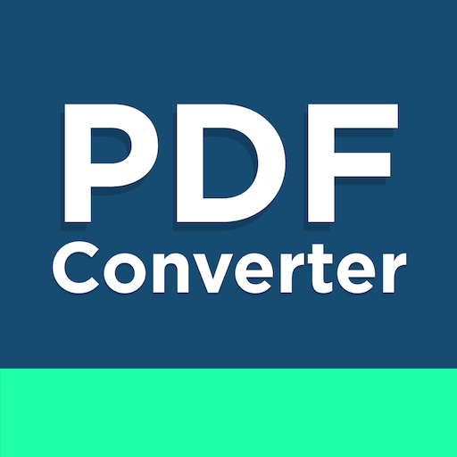

# PDF to DOCX Converter

PDF to DOCX Converter is a Python application that allows you to convert PDF files into Microsoft Word (DOCX) documents. This can be helpful when you need to edit or extract text from PDF files.

## How to Use

1. Clone the project to your computer or download it as a zip file.

2. Python 3 must be installed. If it's not installed, you can download it from the [Python download page](https://www.python.org/downloads/).

3. Install the required Python libraries using the following command:

pip install pdf2docx Pillow

4. Run the application by executing the `pdf_to_docx_converter.py` file.

5. Click the "Select the PDF File" button to choose the PDF file you want to convert.

6. Click the "Select the Location" button to specify where you want to save the converted DOCX file.

7. Click the "Apply" button to convert the PDF to DOCX.

## Screenshot

**Note:** This application is designed for converting PDF files to DOCX format and is for educational purposes only. Make sure you have the necessary rights to convert and modify PDF files.

If you would like to contribute to the development of the project, please feel free to submit a pull request or report any issues.
